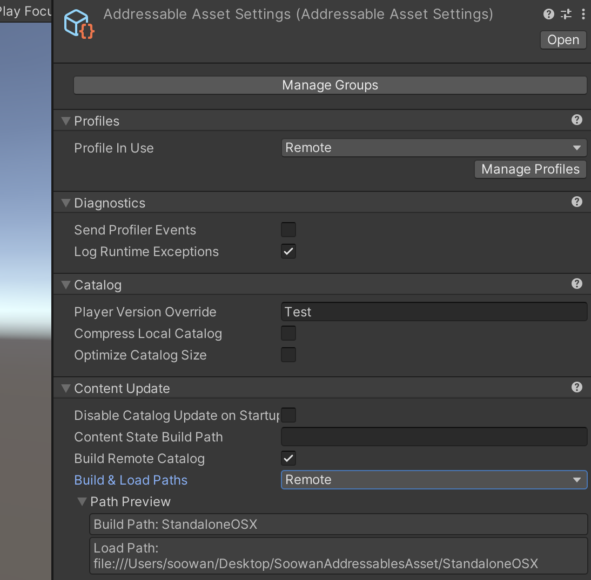
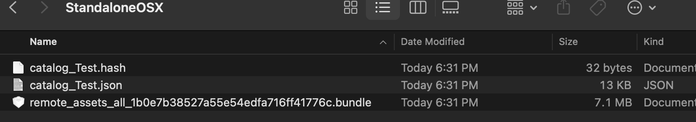
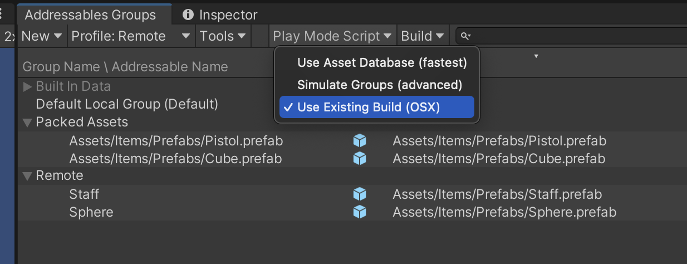

# Soowan Addressables Asset
Build Asset by Addressable, Load Asset by Addressable

## LoadAssetByName
Addressable Name, Addressable Label을 사용하여 큐브 생성
Addressables.InstantiateAsync로 생성해야 ref count가 관리되서 cube의 전체 ref가 0이되면 Asset이 메모리에서 내려간다.

## LoadAssetByRef
AssetReference을 사용하여 cube 생성
AssetLabelReference labelString 사용하여 cube 생성
AssetReferenceGameObject 사용하여 pistol 생성
InstantiateAsync로 생성해야 ref count가 관리되서 cube의 전체 ref가 0이되면 Asset이 메모리에서 내려간다.

## ListOfReferences
AssetReference을 사용하여 비동기로딩이 끝나면 애셋 생성

## 번들 빌드
Addressables Groups window -> build -> Default Build Script

***
현재 빌드타겟폴더에 .bundle로 나옴

## LoadAssetRemotePath
Addressables.LoadResourceLocationsAsync와 label로 IResourceLocation을 얻어와 생성
PrimaryKey, InternalID는 Addressable Name

카탈로그 사용 및 세팅

카탈로그 생성(번들의 변경 정보)

PlayModeScript에서 에디터 모드에서 로컬애셋으로 할지, 설정된 빌드로 할지 지정

Addressables.GetDownloadSizeAsync를 통해 이미 다운로드 됬는지(캐싱되어있는지 확인) 캐시되어있으면 캐시된 번들 사용, 아니면 다운로드
