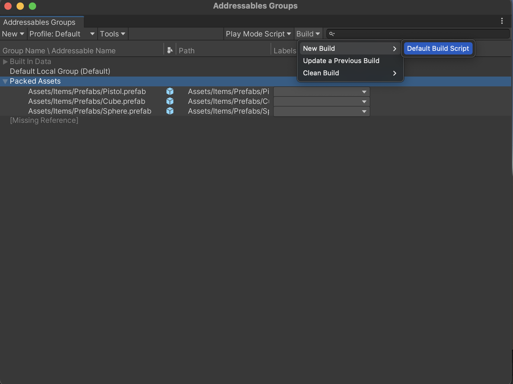
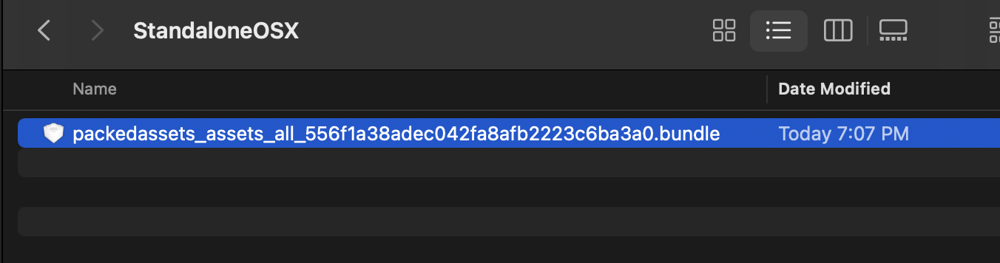

# Soowan Addressables Asset
Build AssetBundle, Use Addressables Asset

## Basic Reference
AssetReference을 사용하여 큐브 생성

## ListOfReferences
AssetReference을 사용하여 비동기로딩이 끝나면 애셋 생성

## 번들 빌드
Addressables Groups window -> build -> Default Build Script

***
현재 빌드타겟폴더에 .bundle로 나옴
